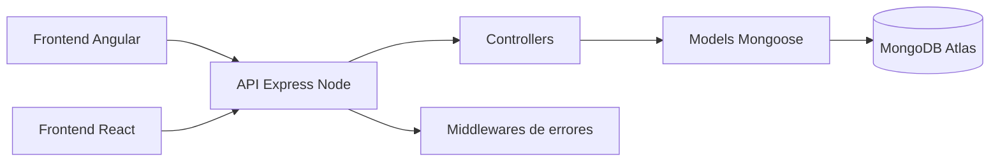
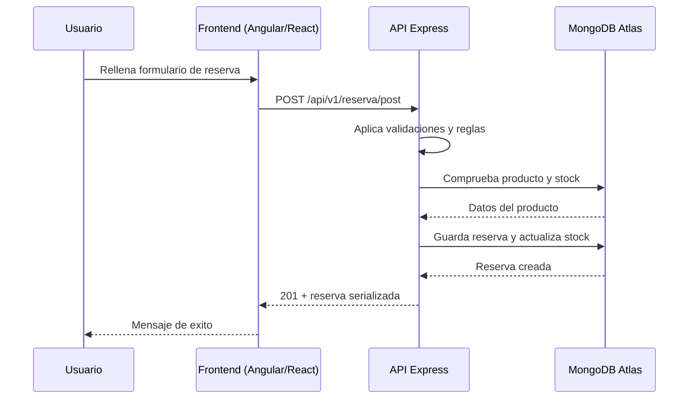

# Proyecto Final Integrador - Elexia Reservas IA

Este proyecto lo hice para automatizar reservas con agentes de voz y chat para distintos negocios (restaurantes, clinicas, gimnasios, centros de belleza, academias y consultorias).

La idea principal es tener una API unica y dos frontends completos (Angular y React) consumiendo la misma logica de negocio.

## Stack tecnologico
- Backend: `Node.js`, `Express`, `MongoDB Atlas`, `Mongoose`
- Frontend 1: `Angular` (standalone + servicios HTTP + formularios reactivos)
- Frontend 2: `React` (componentes funcionales + hooks + React Router)
- UI: `Bootstrap`

## URLs en produccion
- API: `https://backend-mu-mauve-33.vercel.app`
- Angular: `https://frontend-angular-mocha.vercel.app`
- React: `https://frontend-react-ebon.vercel.app`

## Problema que resuelve
Muchos negocios siguen gestionando reservas por WhatsApp o llamadas sin control centralizado. Con este sistema se puede:
- Gestionar productos/servicios con stock y disponibilidad.
- Registrar, buscar y filtrar reservas por estado.
- Aplicar reglas de negocio para evitar errores.
- Trabajar con dos frontends distintos sobre la misma API.

## Como esta montado


## Flujo principal (crear una reserva)


## Entidades
### Product
- `_id`
- `nombre`
- `descripcion`
- `precio` (number)
- `stock` (number)
- `fechaPublicacion` (date)
- `disponible` (boolean)
- `createdAt`
- `updatedAt`

### Reserva
- `_id`
- `nombreCliente`
- `descripcion`
- `producto` (ObjectId ref Product)
- `cantidad` (number)
- `fecha` (date)
- `estado` (`pendiente|confirmada|cancelada`)
- `asistidaPorIA` (boolean)
- `createdAt`
- `updatedAt`

## Reglas de negocio implementadas
- No se permiten productos duplicados por nombre.
- Precio y stock no pueden ser negativos.
- No se puede reservar en fechas pasadas.
- No se puede reservar mas cantidad que el stock disponible.
- No se permiten reservas duplicadas del mismo cliente, producto y fecha.

## API REST
### Utilidades
- `GET /api/v1`
- `GET /api/v1/health`

### Productos
- `POST /api/v1/products`
- `GET /api/v1/products?page=1&limit=10`
- `GET /api/v1/products/:id`
- `PUT /api/v1/products/:id`
- `DELETE /api/v1/products/:id`

### Reservas
- `POST /api/v1/reserva/post`
- `GET /api/v1/reserva/get/all?page=1&limit=10&estado=pendiente`
- `GET /api/v1/reserva/get/:id`
- `PATCH /api/v1/reserva/update/:id`
- `DELETE /api/v1/reserva/delete/:id`

## Ejecucion local
### 1) Backend
```bash
npm --prefix backend install
npm --prefix backend run start
```
URL: `http://localhost:3000`

Opcional (seed manual):
```bash
npm --prefix backend run seed
```

### 2) Frontend Angular
```bash
npm --prefix frontend-angular install
npm --prefix frontend-angular run start -- --port 4200
```
URL: `http://localhost:4200`

### 3) Frontend React
```bash
npm --prefix frontend-react install
npm --prefix frontend-react run start -- --port 5173
```
URL: `http://localhost:5173`

## Checklist segun la rubrica
- Backend por capas (`config`, `models`, `controllers`, `routes`, `middlewares`).
- CRUD completo en productos y reservas.
- Paginacion + filtros.
- Validaciones + manejo de errores y status codes.
- MongoDB Atlas con Mongoose (timestamps y relaciones).
- Angular con servicios HTTP, formularios reactivos, validaciones, mensajes y navegacion completa.
- React con componentes, hooks, consumo API, validaciones, router y estado bien organizado.
- Deploy estable de API + Angular + React en Vercel.

## Guion rapido para la defensa
1. Abrir Angular y React en produccion.
2. Listar productos y reservas en ambos frontends.
3. Crear, editar y borrar un producto.
4. Crear, editar y borrar una reserva.
5. Mostrar `GET /api/v1/health` y documentacion del README.

## Documentacion adicional
- `docs/deploy-api.md`
- `docs/deploy-angular.md`
- `docs/deploy-react.md`
- `docs/rubrica-checklist.md`
